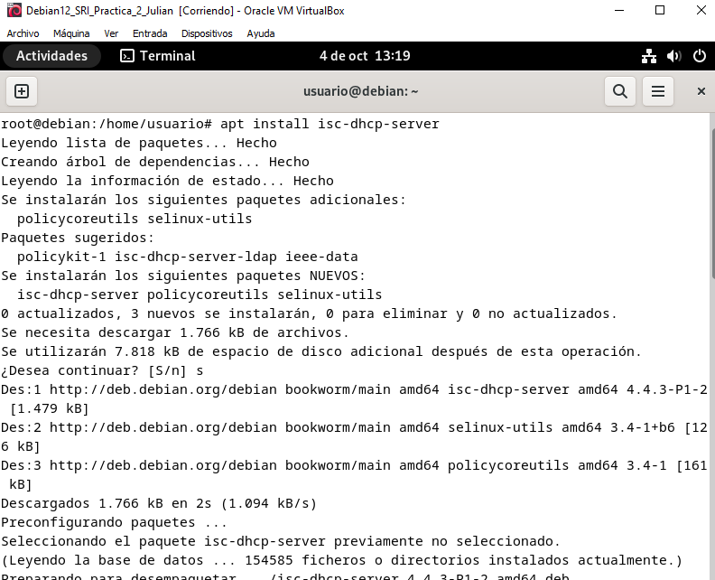
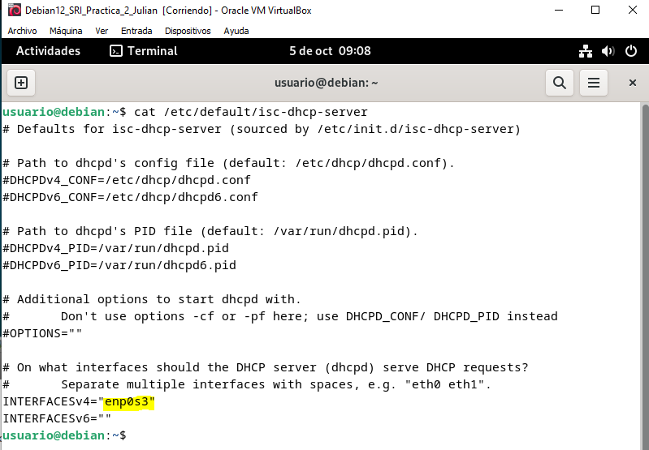

# Práctica 2: Instalación y configuración de servidor y cliente DHCP en Debian
## Índice
[Enlace a introducción](#introducción)   
[Enlace a recursos](#recursos)    
[Enlace a paso1](#paso-1)  
[Enlace a paso2](#paso-2)  
[Enlace a paso3](#paso-3)  
[Enlace a paso4](#paso-4)  
[Enlace a paso5](#paso-5)   
[Enlace a paso6](#paso-6)  
[Enlace a paso7](#paso-7)  
[Enlace a paso8](#paso-8)  
[Enlace a paso9](#paso-9)  
[Enlace a paso10](#paso-10)

## Introducción:

Esta actividad consiste en realizar un tutorial en el que se describan los ficheros involucrados y los comandos necesarios para configurar el servidor isc-dhcp server en Debian. Este tutorial se realizará en lenguaje Markdown y será publicado en GitHub.

## Recursos:
* PC con acceso a internet y paquete ofimático instalado.
* VirtualBox.
* Debian. 
* Windows cliente.
* pfSense.
* https://github.com/
* Visual Studio Code

## Paso 1
Lo primero que debemos de hacer es en las tarjetas de red, ponerle la red interna LAN. Posteriormente en la configuración del adaptador de red, configuraremos la dirección IP, la máscara de red, la puerta de enlace y el DNS:

### Práctica

Estas de aquí son las configuraciones del adaptador de red: En mí caso he puesto la dirección IP: 192.168.16.50 haciendo referencia al 16 a mí número de clase. Una máscara de red qque aserá en este caso /24 es decir la 255.255.255.0, con una puerta de enlace que apuntará a nuestra máquina pfSense, que será nuestro router y finalmente pondremos el DNS 8.8.8.8 y como secundario el 8.8.4.4 por si el primero da algún tipo de fallo.  

También comprobamos que el pfSense tiene esa dirección y no nos hemos confundido a la hora de configurar la puerta de enlace del Debian, y efectivamente, tiene la IP 192.168.16.1. Si queremos cambiarla tendríamos 2 opciones, la primera desde el pfSense, ponemos el número 2 para entrar a las opciones de las interfaces IP y empezaríamos a modificarlo. La segunda opción sería desde un equipo cliente poner http:// y la dirección IP actual del pfSense para entrar a su configuración y lo podríamos cambiar sin ningún tipo de problema.   

## Paso 2

Una vez que hemos configurado los parámetros de red, procederemos a comenzar con la instalación del DHCP. Para ello debemos de poner el siguiente comadno: apt install isc-dhcp-server.
Este servidor DHCP implementa el protocolo de configuración dinámica de host (DHCP), que permite que los hosts de una red TCP/IP soliciten y sean asignados direcciones IP, y, además, que detecten información sobre la red a la cual están conectados.

### Práctica

Seguido a la instalación, deberíamos de hacer una copia por si en algún momento al modificar el archivo original la liamos y borramos o modificamos alguna cosa que no deberíamos y así poder volver al archivo original. Antes de realizar la copiar entramos como su - y después el comando para poder realizar la copia:

Una vez que hacemos la copia, modificamos ese archvio con el comando nano y añadimos enp0s3 en interfacesv4:

Para poder comprobar que hemos realizado bien los cambios, deberemos de poner el siguiente comando:

## Paso 3

Observamos la configuración del servicio DHCP dentro de la carpeta etc/dhcp/ y después se realiza un ls -alt para poder observarlo:

### Práctica

## Paso 4

Después, hacemos una copia del archivo dhcpd.conf antes de empezar a modificar dicho archivo.

### Práctica

Una vez realizado la copia, entramos a la configuración del dhcpd con el comando nano, y modificamos todo lo que no está comentado.  

## Paso 5

Modificamos el host fantasía en el mismo sitio de antes, solamente que esto lo podemos encontrar más abajo. En él, modificamos el nombre, la mac, en la que ponemos la de nuestro cliente y la IP que ponemos la que se nos va a reservar:

### Práctica

## Paso 6

Una vez realizado los pasos anteriores, iniciamos el servicio, pero antes deberíamos de pararlo, después lo arrancamos y finalmente lo iniciamos:

### Práctica

## Paso 7

Comprobamos desde nuestra máquina clietne la configuración ip mediante dhcp. Para ello, hemos tenido que poner la red en Red Interna lan, y para ver la dirección ip, desde el cmd escribimos ipconfig /all. También hemos configurado en el adaptador de red que me lo asigne mediante dhcp:

### Práctica

## Paso 8

Ahora vamos a comprobar creando una máquina cliente windows que nos da otra ip distinta asignada a nuestro rango de direcciones con las mismas configuraciones, menos la configración en el host fantasia. Para poder comprobarlo, realizamos el comando de ipconfig /all: 

### Práctica

## Paso 9

La última comprobación sería en ambas máquinas clientes, hacer ping a google y ping al servidor para ver si tenemos conexión a internet y conexión también con el servidor:

### Práctica  
Comprobación del primer clietne:  

Comprobación del segundo cliente:  

## Paso 10

Journald es un sistema de gestión de logs que se convertirá en estándar en la mayoría de los linux modernos.

### Práctica

## IPs
## Router pfSense
192.168.16.1/24
## Servidor DHCP Debian
192.168.16.50/24
## Cliente con reserva
192.168.16.60
## Cliente sin reserva
DHCP