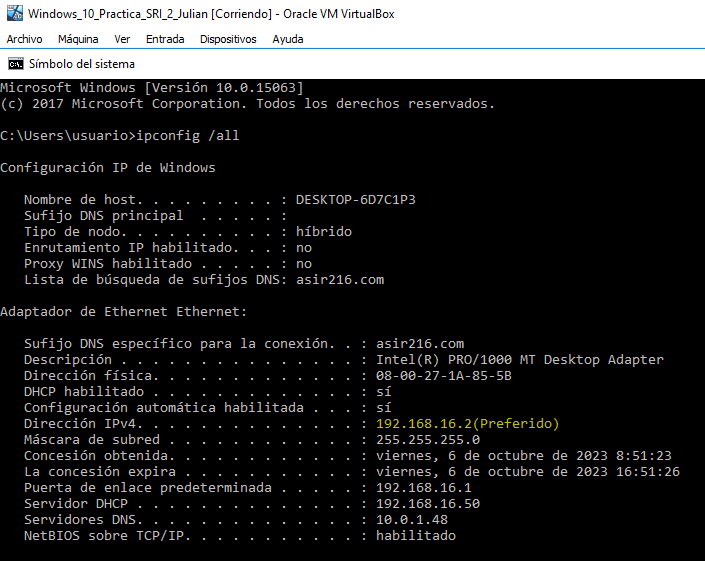

# Práctica 2: Instalación y configuración de servidor y cliente DHCP en Debian
## Índice
[Enlace a introducción](#introducción)   
[Enlace a recursos](#recursos)    
[Enlace a paso1](#paso1)  
[Enlace a paso2](#paso2)  
[Enlace a paso3](#paso3)  
[Enlace a paso4](#paso4)  
[Enlace a paso5](#paso5)   
[Enlace a paso6](#paso6)  
[Enlace a paso7](#paso7)  
[Enlace a paso8](#paso8)  
[Enlace a paso9](#paso9)  
[Enlace a paso10](#paso10)  
[Enlace a paso11](#paso11)  
[Enlace a paso12](#paso12)  
[Enlace a paso13](#paso13)  
[Enlace a paso14](#paso14)  

## Introducción:

Esta actividad consiste en realizar un tutorial en el que se describan los ficheros involucrados y los comandos necesarios para configurar el servidor isc-dhcp server en Debian. Este tutorial se realizará en lenguaje Markdown y será publicado en GitHub

## Recursos:
* PC con acceso a internet y paquete ofimático instalado.
* VirtualBox.
* Debian. 
* Windows cliente.
* pfSense.
* https://github.com/
* Visual Studio Code

## Paso_1
``` 
Lo primero que debemos de hacer es en las tarjetas de red, ponerle la red interna LAN. Posteriormente en la configuración del adaptador de red, configuraremos la dirección IP, la máscara de red, la puerta de enlace y el DNS:
``` 
### Práctica


## Paso_2
``` 
Una vez que hemos configurado los parámetros de red, procederemos a comenzar con la instalación del DHCP.
``` 
### Práctica


## Paso_3
``` 
Observamos la configuración del servicio DHCP:
``` 
### Práctica

## Paso_4
``` 
Después, hacemos una copia del archivo dhcpd.conf antes de empezar a modificar dicho archivo.

``` 
### Práctica


## Paso_5
``` 
Modificamos Host Fantasía:

``` 
### Práctica

## Paso_6
``` 
Iniciamos servicio:
``` 
### Práctica

## Paso_7
``` 
Comprobamos desde nuestra máquina clietne la configuración ip mediante dhcp. Para ello, hemos tenido que poner la red en Red Interna lan, y para ver la dirección ip, desde el cmd escribimos ipconfig /all:
``` 
### Práctica

## Paso_8
``` 
Ahora vamos a comprobar creando una máquina cliente windows que nos da otra ip distinta asignada a nuestro rango de direcciones: 
``` 
### Práctica

## Paso_9
``` 
La última comprobación sería en ambas máquinas clientes, hacer ping a google y ping al servidor para ver si tenemos conexión a internet y conexión también con el servidor:
``` 
### Práctica  
Comprobación del primer clietne:  


Comprobación del segundo cliente:  


## Paso_10
``` 


``` 
### Práctica

## Paso_11
``` 


``` 
### Práctica

## Paso_12
``` 


``` 
### Práctica

## Paso_13
``` 


``` 
### Práctica

## Paso_14
``` 


``` 
### Práctica